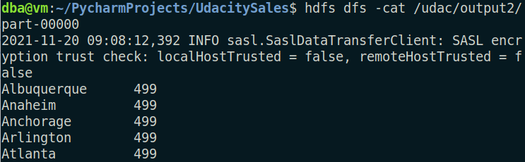

# Sales-Analysis-with-MapReduce-based-on-Udacity-Big-Data-Course-

To execute these files using Hadoop, you run first the following commands :

1. start hadoop demons
```
start-all.sh
```
2. Recover the namenode state
```
hdfs dfsadmin -safemode get
```
3. Create a directory 'udac' and put your input files in the HDFS
```
hdfs dfs -mkdir /udac
hdfs dfs -put purcases.txt /udac/
hdfs dfs -put data.txt /udac/
```
4. launch the hadoop job
```
hadoop jar /usr/local/hadoop/hadoop-*streaming*.jar -file mapperi.py -mapper mapperi.py -file reduceri.py -reducer reduceri.py -input udac/purchases.txt -output /udac/outputi
```

## Part 1 : Sales By Product
- mapper1.py
- reducer1.py

**Output :**


## Part 2 : The monetary value for the highest individual sale for each separate store
- mapper2.py
- reducer2.py

**Output :**



All stores have the same result, to confirm that it is not a problem in the code I executed it on just a part of my dataset, and I got the following output :

**Output :**


## Part 3 : The total sales & the total number of sales value across all the stores
- mapper3.py
- reducer3.py

**Output :**


